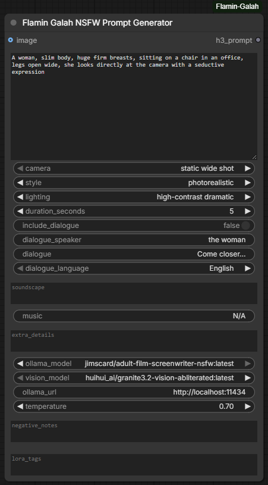
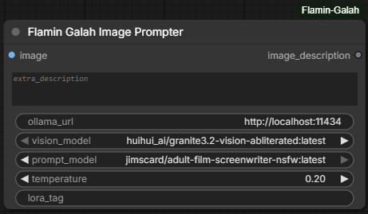

<p align="center">
  
</p>

<h1 align="center">ComfyUI Flamin Galah</h1>

<p align="center">
  Custom ComfyUI nodes that turn filmmaker-style fields and stills into official
  <strong>MiniMax H3</strong> <strong>T2VA</strong> and <strong>I2VA</strong> prompts.
  Local <strong>Ollama</strong> or the <strong>xAI Grok</strong> API.
  Every node outputs one string: <code>h3_prompt</code>.
</p>

<p align="center">
  
  
  
  
  
</p>

<p align="center">
  <a href="https://github.com/flamin-galah/ComfyUI-Flamin-Galah">github.com/flamin-galah/ComfyUI-Flamin-Galah</a>
</p>

---

## What this pack does

MiniMax H3 wants a rigid three-field prompt, not a free-form idea dump:

```
integrated_multimodal_description: [Shot 1] ...
overall_soundscape: ...
non_diegetic_music: ...
```

Image-to-video (**I2VA**) also wants a first-frame lock line when a still is the opening frame:

```
For the target video, at 0.00 seconds into the target video, <Picture 1> (from [Shot 1]) is fully referenced.
```

Text-only generation is **T2VA** (no picture line). These nodes fill that structure for you. Wire `h3_prompt` into whatever MiniMax H3 / text node you use.

| Node | Category | Mode | Output |
| --- | --- | --- | --- |
| **Flamin Galah NSFW Prompt Generator** | `prompt/Flamin Galah` | Fields → local Ollama → **T2VA**. Connect an image to switch to **I2VA**. | `h3_prompt` |
| **Flamin Galah Image Describer** | `prompt/Flamin Galah` | Image → Ollama vision + writer → **Image to Video** (H3 fields) or **Image to Image** (plain paragraph). | `h3_prompt` |
| **Flamin Galah Grok Image Describer** | `prompt/Flamin Galah` | Image → xAI Grok API → **I2VA** block. | `h3_prompt` |

<p align="center"><em>Flamin Galah NSFW Prompt Generator — action, camera, style, lighting, dialogue, sound, and Ollama model. Output socket: h3_prompt.</em></p>

<p align="center">
  
</p>

<p align="center"><em>Flamin Galah Image Describer — local Ollama vision + writer. Toggle Image to Video or Image to Image. Output socket: h3_prompt.</em></p>

<p align="center">
  
</p>

<p align="center"><em>Flamin Galah Grok Image Describer — I2VA via the xAI Grok API. Output socket: h3_prompt.</em></p>

<p align="center">
  
</p>

---

## Install

1. Clone or copy this repo into `ComfyUI/custom_nodes/ComfyUI-Flamin-Galah`.
2. Fully restart ComfyUI (a simple refresh is not enough the first time).
3. Add nodes from **Add Node → prompt → Flamin Galah**.
4. If an older Flamin Galah node is already on the canvas, delete it and add a fresh one so the output socket is `h3_prompt` and the widgets match the current schema.

```bash
cd ComfyUI/custom_nodes
git clone https://github.com/flamin-galah/ComfyUI-Flamin-Galah.git
```

No extra Python packages beyond a normal ComfyUI install (`torch`, `numpy`, `Pillow`).

---

## Setup: local Ollama (prompt generator + image describer)

1. Install and start [Ollama](https://ollama.com/) so it listens on `http://localhost:11434`.
2. Pull a writer model. Uncensored / adult-capable models work best for NSFW scenes:

   ```bash
   ollama run jimscard/adult-film-screenwriter-nsfw
   ```

   Also reported as working well:

   ```bash
   ollama pull fluffy/l3-8b-stheno-v3.2
   ```

3. For I2VA and the Image Describer, also pull a **vision** model:

   ```bash
   ollama pull llava
   ollama pull qwen2.5-vl
   ollama pull llama3.2-vision
   ```

The `ollama_model` / `vision_model` / `prompt_model` dropdowns are filled from `GET /api/tags` when the node class loads. Start Ollama *before* launching ComfyUI, or restart after pulling models.

---

## Setup: Grok Image Describer

The Grok node talks to `https://api.x.ai/v1/chat/completions`.

Provide a key in one of these ways:

- paste it into the node's `api_key` widget, or
- set `XAI_API_KEY` or `GROK_API_KEY` in the environment that launches ComfyUI.

Selectable models: `grok-4.7`, `grok-4.6`, `grok-4.5`, `grok-4`, `grok-2-vision-1212`.

---

## Node reference

### 1. Flamin Galah NSFW Prompt Generator

**Output:** `h3_prompt` (`STRING`)

No image → **T2VA**. Image connected → **I2VA** (vision model describes the frame, the writer evolves it with your action fields, and the official first-frame line is prepended).

**Required widgets**

| Widget | Role |
| --- | --- |
| `action` | Scene / subject / motion. Tall multiline field (frontend forces ~180px). |
| `camera` | Presets: static wide, POV, slow push-in, tracking, dolly zoom, handheld, low-angle, aerial, orbit, close-up, pan, intimate close-up, slow tilt up. |
| `style` | live-action cinematic, photorealistic, erotic film, softcore cinematic, glamour, anime, cyberpunk, film noir, documentary. |
| `lighting` | Practical / mood presets (soft red, candlelight, neon wet streets, golden hour, moonlight, chiaroscuro, …). |
| `duration_seconds` | 4–15 second pills at the top of the node, labelled **Duration**. Written into the shot as “The shot lasts about N seconds.” Hover a pill for the same hint. |
| `include_dialogue` | If on, dialogue is copied **verbatim** into `<d>[Language] exact words</d>`. Nothing is invented. |
| `dialogue_speaker` / `dialogue` / `dialogue_language` | Speaker label, exact line, language tag. |
| `soundscape` | Diegetic audio only (breathing, fabric, rain, room tone). Never merged into the visual field. |
| `music` | Non-diegetic score. Use `N/A` for silence. |
| `extra_details` | Texture, DoF, atmosphere. |
| `ollama_model` | Live list from your Ollama instance. |

**Optional**

| Widget | Role |
| --- | --- |
| `image` | Connecting an `IMAGE` switches the node from T2VA to **I2VA**. |
| `vision_model` | Ollama vision model used only when `image` is connected. |
| `ollama_url` | Default `http://localhost:11434`. |
| `temperature` | Default `0.7`. |
| `negative_notes` | Guidance for the LLM only — **not** written into `integrated_multimodal_description`. |
| `lora_tags` | Optional trigger words appended for LoRA-aware pipelines. |

**Rules the writer is instructed to follow**

- English except spoken dialogue and on-screen text.
- First shot starts with `[Shot 1]` (no timestamp).
- Camera movement is explicit.
- On-screen text in English double quotes.
- No sound inside `integrated_multimodal_description`.
- No “Avoid / negative” lines in the visual field.

---

### 2. Flamin Galah Image Describer (Ollama)

Local-only pipeline. Image only — no video input.

1. **Vision model** describes the connected image (identity, clothing, pose, lighting, set — no invented action, no sound).
2. **Prompt model** turns that description + `extra_description` into a shot paragraph.
3. If `output_mode` is **Image to Video**, a third call writes `overall_soundscape`. **Image to Image** skips that call and returns the paragraph only.

**Inputs**

| Name | Type | Notes |
| --- | --- | --- |
| `image` | `IMAGE` | Required. Batch item 0 is used. |
| `output_mode` | `Image to Video` / `Image to Image` | Image to Video = H3 video fields. Image to Image = plain paragraph. |
| `extra_description` | string | Optional “what happens next” / camera move. |
| `vision_model` / `prompt_model` | Ollama dropdowns | Vision vs writer. |
| `temperature` | float | Default `0.2`. |
| `lora_tag` | string | Optional. Appended after the prompt. |
| `ollama_url` | string | Default localhost. |

**Output:** `h3_prompt` (`STRING`). Image to Video is `integrated_multimodal_description`, `overall_soundscape`, and `non_diegetic_music: N/A` (no I2VA reference line). Image to Image is the paragraph only.

---

### 3. Flamin Galah Grok Image Describer

Same I2VA shape as the Ollama image-to-video path, but every call goes to xAI.

**Inputs:** `image`, `extra_description`, `api_key`, `grok_url`, `grok_model`, `temperature` (default `0.2`).

**Output:** `h3_prompt` (`STRING`).

Flow: vision describe → enhance with your extra prompt → soundscape from the still. Identity, clothing, body, set, and lighting from the photo are preserved; your extra text becomes the *continuation* after frame 0. The block includes the official first-frame lock line.

---

## Example T2VA output

```
integrated_multimodal_description: [Shot 1] Photorealistic, high-contrast dramatic light. A slim woman with huge firm breasts sits on an office chair, legs open wide, looking into lens. The shot lasts about 5 seconds. Camera holds a static wide shot. Subtle skin texture, shallow depth of field.

overall_soundscape: Soft breathing, fabric sliding on the chair, distant rain against the window.

non_diegetic_music: N/A
```

## Example I2VA header

```
For the target video, at 0.00 seconds into the target video, <Picture 1> (from [Shot 1]) is fully referenced.

integrated_multimodal_description: [Shot 1] Live-action, cinematic, ...
overall_soundscape: ...
non_diegetic_music: N/A
```

---

## Typical graphs

**Text-to-video (T2VA)**

`Flamin Galah NSFW Prompt Generator` → `h3_prompt` → MiniMax H3 text consumer

**Image-to-video (local I2VA)**

`Load Image` → `Flamin Galah Image Describer` (`output_mode` = Image to Video) → `h3_prompt`

or connect the same image into the generator’s optional `image` input.

**Image-to-image**

`Load Image` → `Flamin Galah Image Describer` (`output_mode` = Image to Image) → `h3_prompt`

**Image-to-video (cloud I2VA)**

`Load Image` → `Flamin Galah Grok Image Describer` → `h3_prompt`

---

## Troubleshooting

| Symptom | Fix |
| --- | --- |
| Dropdown says “Ollama not running” | Start Ollama, then restart ComfyUI so `_get_ollama_models()` can hit `/api/tags`. |
| `Could not reach Ollama` | Check `ollama_url`, firewall, and that the daemon is up. |
| Empty / weak image description | Use a real vision model (`llava`, `qwen2.5-vl`, `llama3.2-vision`), not a text-only tag. |
| Grok node errors on key | Paste `api_key` or export `XAI_API_KEY` / `GROK_API_KEY` for the ComfyUI process. |
| Output still named `prompt` or `image_description` | Delete the node from the graph and add a new one. All three nodes now expose `h3_prompt`. |
| Action box too small | The pack ships `web/flamin_galah.js`, which forces a taller `action` widget and a minimum node size. |

---

## Repo layout

```
ComfyUI-Flamin-Galah/
├── __init__.py                  # NODE mappings + WEB_DIRECTORY
├── LICENSE                      # MIT
├── README.md
├── pyproject.toml
├── docs/
│   ├── flamin-galah-logo.png
│   ├── nsfw-prompt-generator.png
│   ├── image-prompter.png
│   └── grok-api-prompter.png
├── nodes/
│   ├── __init__.py
│   ├── node_nsfw_prompt_generator.py
│   ├── node_image_describer.py
│   └── node_grok_api_image_describer.py
└── web/
    ├── flamin_galah.js          # larger action textarea, duration pills
    └── flamin-galah-logo.png
```

---

## License

MIT © 2026 flamin-galah
