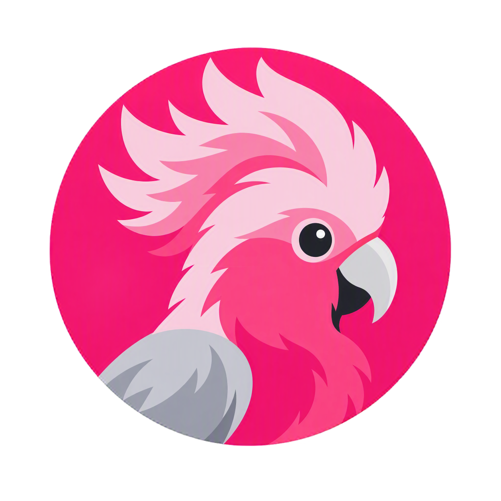
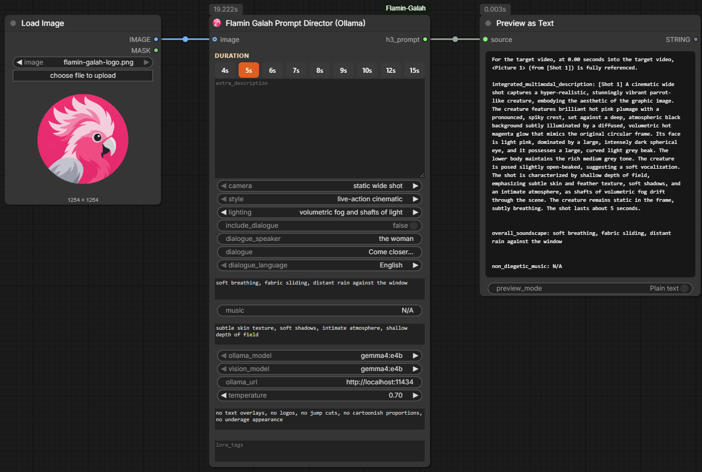
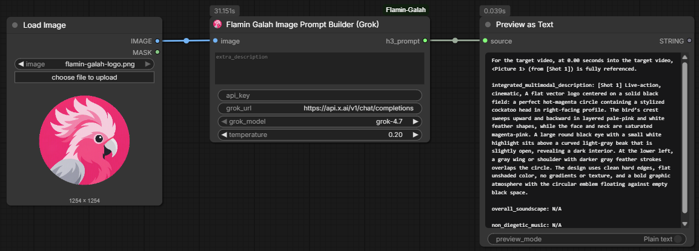

<p align="center">
  
</p>

# ComfyUI Flamin Galah

**Director-style prompt building for MiniMax H3, powered by local Ollama models or the xAI Grok API.**

Turn scene directions or a reference image into structured video prompts, including visual descriptions, soundscapes, and music guidance. All three nodes are geared towards **MiniMax H3**, but the model name is intentionally omitted from their visible titles.

Every node returns one `STRING` output named **`h3_prompt`**. This pack builds prompts; it does **not** generate images or videos, install MiniMax models, or submit video-generation jobs.

[Repository](https://github.com/flamin-galah/ComfyUI-Flamin-Galah) · [Ollama](https://ollama.com/) · [xAI API documentation](https://docs.x.ai/)

## Nodes at a glance

All nodes appear under **Add Node → prompt → Flamin Galah**.

| Node | Input workflow | Provider | Output |
| --- | --- | --- | --- |
| **Flamin Galah Prompt Director (Ollama)** | Scene fields; optional first-frame image | Ollama | H3-style T2VA or I2VA prompt |
| **Flamin Galah Image Prompt Builder (Ollama)** | Reference image plus optional scene directions | Ollama | H3-style video fields, or a plain image-prompt paragraph |
| **Flamin Galah Image Prompt Builder (Grok)** | Reference image plus optional scene directions | xAI Grok API | H3-style I2VA prompt with first-frame reference line |

**T2VA** means the pack's text-to-video-with-audio prompt mode. **I2VA** means its image-to-video-with-audio prompt mode. These labels describe prompt text, not generation performed by the nodes.

## Installation

### Install the supplied ZIP

1. Extract the ZIP.
2. Place the included `ComfyUI-Flamin-Galah` folder inside `ComfyUI/custom_nodes/`.
3. If updating an existing installation, back it up and replace that folder. **Do not keep two active copies of this pack in `custom_nodes`.**
4. Fully restart ComfyUI, then reload its browser interface.
5. Add the nodes from **prompt → Flamin Galah**.

The resulting layout should be:

```text
ComfyUI/
└── custom_nodes/
    └── ComfyUI-Flamin-Galah/
        ├── __init__.py
        ├── nodes/
        └── web/
```

Avoid an extra nested `ComfyUI-Flamin-Galah/ComfyUI-Flamin-Galah/` folder.

### Clone the upstream repository

```bash
cd ComfyUI/custom_nodes
git clone https://github.com/flamin-galah/ComfyUI-Flamin-Galah.git
```

The upstream repository may still use earlier node titles. Use the supplied ZIP to install this renamed build.

### Requirements

- A working ComfyUI installation.
- `torch`, `numpy`, and `Pillow`, normally included with ComfyUI.
- Ollama with installed models for the two local nodes, or an xAI API key for the Grok node.

There are no additional Python dependencies declared by the pack.

## Ollama setup

The **Prompt Director** and **Image Prompt Builder (Ollama)** call Ollama's `/api/chat` endpoint. The default server is `http://localhost:11434`.

1. Install and start [Ollama](https://ollama.com/download).
2. Pull a text-writing model, for example:

   ```bash
   ollama pull llama3.2
   ```

3. For image input, also pull a vision-capable model, for example:

   ```bash
   ollama pull qwen2.5vl
   ```

   Alternatives include `llava` and `llama3.2-vision`. You only need one suitable vision model, not all three.

4. Start or restart ComfyUI after the models are available.
5. Explicitly select a **vision model** for `vision_model` and a **writer model** for `ollama_model` or `prompt_model`.

The correct official Qwen tag is **`qwen2.5vl`**, not `qwen2.5-vl`. See the [Qwen2.5-VL library page](https://ollama.com/library/qwen2.5vl). The [Llama 3.2 library page](https://ollama.com/library/llama3.2) describes the text-only writer example.

Model suitability, resource requirements, and response quality depend on the model you select. For adult-themed creative requests, choose an appropriate model and follow its applicable terms; support is not guaranteed by this pack.

### Model dropdowns and remote servers

The dropdowns are populated from `GET /api/tags` when ComfyUI requests the node's input schema. Current discovery uses the default localhost server; it does **not** use the custom `ollama_url` widget value.

Installed model names are sorted alphabetically and are not filtered by vision capability. The first selected model may therefore be unsuitable for image input. Restarting ComfyUI is the simplest way to refresh the choices after starting Ollama or pulling a model.

Changing `ollama_url` changes the destination of generation requests. A remote URL sends prompt and image data to that server; the workflow is only local when the configured server is local.

## Grok setup

**Flamin Galah Image Prompt Builder (Grok)** uses this endpoint by default:

```text
https://api.x.ai/v1/chat/completions
```

Provide a key through an environment variable in the process that launches ComfyUI:

```bash
# Linux / macOS shell
export XAI_API_KEY="YOUR_XAI_API_KEY"
```

```powershell
# Windows PowerShell
$env:XAI_API_KEY = "YOUR_XAI_API_KEY"
```

`GROK_API_KEY` is also supported. Alternatively, enter the key in the node's `api_key` widget; a non-empty widget value takes precedence over the environment variables.

**Environment variables are preferable for shareable workflows.** The key widget is a normal visible string field. Check saved workflow files for secrets before sharing them.

The current dropdown contains `grok-4.7`, `grok-4.6`, `grok-4.5`, `grok-4`, and `grok-2-vision-1212`, with `grok-4.7` selected by default. This is a hard-coded list, not live account discovery. Model availability and image support depend on the provider and your account; consult the [current model catalog](https://docs.x.ai/developers/models).

> **Privacy:** the Grok node uploads the first image in the batch and sends prompt text to the configured endpoint. A custom `grok_url` also receives the bearer API key. Use a trusted HTTPS endpoint, and inspect endpoint settings in workflows received from others. Provider usage charges may apply.

## Node reference

### Flamin Galah Prompt Director (Ollama)

Builds a prompt from scene directions and filmmaker-style controls using Ollama.

- **Without an image:** writes a T2VA-style prompt.
- **With an image:** asks a vision model to describe frame 0, then asks a writer model to develop the requested scene as an I2VA-style prompt.
- **Output:** `h3_prompt` (`STRING`).

#### Main widgets

| Widget | Purpose |
| --- | --- |
| `extra_description` | Subject, scene, action, and continuation. Multiline editor; the frontend requests a taller editor for this node. |
| `camera` | Camera angle or motion preset, such as static wide shot, slow push-in, orbit, handheld, or pan. |
| `style` | Visual style preset, including live-action, photorealistic, glamour, anime, cyberpunk, or documentary. |
| `lighting` | Lighting preset, including candlelight, neon, golden hour, moonlight, or chiaroscuro. |
| `duration_seconds` | Desired duration written into the prompt, not a video-generator setting. Backend range: 4–15 seconds. |
| `include_dialogue` | Enables insertion of the supplied dialogue. |
| `dialogue_speaker` | Speaker label. |
| `dialogue` | Exact line to insert; leading and trailing whitespace is trimmed. |
| `dialogue_language` | Language tag. Selecting `other` inserts an unlabelled `<d>…</d>` tag. |
| `soundscape` | Desired diegetic audio, such as ambience, breathing, fabric movement, or footsteps. |
| `music` | Non-diegetic score guidance. Use `N/A` for no score. |
| `extra_details` | Additional texture, atmosphere, depth of field, or scene details. |
| `ollama_model` | Text-writing model. |

The duration pills offer **4, 5, 6, 7, 8, 9, 10, 12, and 15 seconds**. Verify the final text: current cleanup does not replace a different duration already written by the model.

#### Optional inputs

| Input | Purpose |
| --- | --- |
| `image` | Connecting an `IMAGE` enables image-based prompting. Only batch item 0 is used. |
| `vision_model` | Model used to describe the connected image; select a vision-capable model. |
| `ollama_url` | Server URL; defaults to `http://localhost:11434`. |
| `temperature` | Generation temperature; defaults to `0.7`. |
| `negative_notes` | Guidance supplied to the writer, not a separate output field. |
| `lora_tags` | Appends a `LoRA tag:` section after the prompt when populated. |

The writer is instructed to preserve the reference image, describe camera motion, separate visuals from audio, and avoid inventing dialogue. These are model instructions, not a guarantee that every response satisfies every rule.

If the writer fails, this node returns a structured text fallback and logs the failure. If image description fails, it currently continues without a reliable image-description anchor. Check the ComfyUI console and review the result before using it downstream.

### Flamin Galah Image Prompt Builder (Ollama)

Starts from a still image and uses separate Ollama vision and writing passes. It does not accept video input.

1. The vision model describes the first image in the batch.
2. The writer combines that description with `extra_description`.
3. In **Image to Video** mode, a third call writes the soundscape. **Image to Image** mode skips this call.

| Input | Purpose |
| --- | --- |
| `image` | Required `IMAGE`; only batch item 0 is used. |
| `output_mode` | `Image to Video` or `Image to Image`. |
| `extra_description` | Additional action, camera direction, or continuation; empty by default. |
| `vision_model` | Vision-capable Ollama model. |
| `prompt_model` | Ollama writer model. |
| `temperature` | Defaults to `0.2`. |
| `ollama_url` | Defaults to `http://localhost:11434`. |
| `lora_tag` | Optional text appended as a `LoRA tag:` section. |

**Image to Video output:** three H3-style fields with `non_diegetic_music: N/A`. Unlike the Prompt Director's image path and the Grok node, the current formatter **does not prepend the first-frame-reference line**.

**Image to Image output:** a plain prompt paragraph rather than the three video fields. It still uses the output socket named `h3_prompt`.

This node downsizes the image sent to vision to a maximum side of 1024 pixels and encodes it as JPEG. The Prompt Director and Grok node currently use full-resolution PNGs instead.

### Flamin Galah Image Prompt Builder (Grok)

Uses the configured xAI-compatible API rather than Ollama.

1. Uploads the first image in the batch for visual description.
2. If `extra_description` is non-empty, rewrites the description to incorporate the requested continuation.
3. Generates a soundscape from the final description.
4. Returns an I2VA-style block with the first-frame-reference line and `non_diegetic_music: N/A`.

| Input | Purpose |
| --- | --- |
| `image` | Required `IMAGE`; only batch item 0 is used. |
| `extra_description` | Additional action, camera direction, or continuation; empty by default. |
| `api_key` | Optional widget key; otherwise resolved from the environment. |
| `grok_url` | API endpoint; use only a trusted destination. |
| `grok_model` | Model selected from the bundled list. |
| `temperature` | Defaults to `0.2`. |

A run makes **two model calls**, or **three** when extra directions are supplied. The original image is attached to the first call; later calls use text derived from the description. API failures raise errors rather than using the Prompt Director's structured fallback.

## Prompt structure and examples

The video-oriented paths use these fields:

```text
integrated_multimodal_description: [Shot 1] ...

overall_soundscape: ...

non_diegetic_music: ...
```

### Text-based video prompt

```text
integrated_multimodal_description: [Shot 1] Live-action cinematic. A woman in a red coat stands beside a rain-streaked window and slowly turns towards the room. The camera makes a gentle push-in. Warm practical lighting contrasts with the cool blue street outside. The shot lasts about 5 seconds.

overall_soundscape: Rain taps against the glass. Fabric rustles as she turns. Quiet room tone continues underneath.

non_diegetic_music: N/A
```

### Image-based video prompt

The Prompt Director's image path and the Grok node prepend:

```text
For the target video, at 0.00 seconds into the target video, <Picture 1> (from [Shot 1]) is fully referenced.

integrated_multimodal_description: [Shot 1] The scene begins from the supplied still, preserving the subject, clothing, composition, and lighting. The subject slowly turns towards the camera as it moves forward.

overall_soundscape: Soft fabric movement and quiet room ambience.

non_diegetic_music: N/A
```

These examples illustrate the pack's intended format; check the requirements of your actual downstream MiniMax H3 integration. The local Image Prompt Builder omits the reference line in its current implementation. Populated LoRA fields append an extra section, so leave them blank if your downstream consumer expects exactly three fields.

## Example workflows

**Text-based video prompting**

```text
Flamin Galah Prompt Director (Ollama) → h3_prompt → your MiniMax H3 prompt consumer
```

**Image-based prompting with the director**

```text
Load Image → Flamin Galah Prompt Director (Ollama) [image input] → h3_prompt
```

**Local image-to-video prompting**

```text
Load Image → Flamin Galah Image Prompt Builder (Ollama)
             output_mode = Image to Video
             → h3_prompt
```

**Local image-to-image prompting**

```text
Load Image → Flamin Galah Image Prompt Builder (Ollama)
             output_mode = Image to Image
             → h3_prompt
```

**Cloud image-to-video prompting**

```text
Load Image → Flamin Galah Image Prompt Builder (Grok) → h3_prompt
```

`h3_prompt` is text. Wire it into the appropriate text/prompt input in your generation workflow, and provide the original image separately wherever that downstream workflow requires it.

## Screenshots

The bundled screenshots show the current node titles and example outputs using the Flamin Galah logo as the reference image.

### Prompt Director (Ollama)



### Image Prompt Builder (Ollama)


### Image Prompt Builder (Grok)



## Node Python filenames

| Node | Module filename |
| --- | --- |
| Flamin Galah Prompt Director (Ollama) | `node_prompt_director_ollama.py` |
| Flamin Galah Image Prompt Builder (Ollama) | `node_image_prompt_builder_ollama.py` |
| Flamin Galah Image Prompt Builder (Grok) | `node_image_prompt_builder_grok.py` |

`nodes/__init__.py` remains the package initializer and imports these three modules. When updating, replace the complete plugin folder rather than merging old and new module files.

## Existing-workflow compatibility

This build updates visible names, tooltip labels, documentation, and the node Python filenames. Internal IDs, class names, category, input/output schemas, and generation behavior remain unchanged. Imports have been updated to match the new filenames.

| Earlier title | Current title | Unchanged internal ID |
| --- | --- | --- |
| Flamin Galah NSFW Prompt Generator | Flamin Galah Prompt Director (Ollama) | `FlaminGalahNSFWPromptGenerator` |
| Flamin Galah Image Describer | Flamin Galah Image Prompt Builder (Ollama) | `FlaminGalahImageDescriber` |
| Flamin Galah Grok Image Describer | Flamin Galah Image Prompt Builder (Grok) | `FlaminGalahGrokImageDescriber` |

Existing workflows retain their node references. Saved or manually customized canvas titles may retain older text; edit the title or add a fresh node if you want the new label. For workflows from versions with different widget schemas or output names, back up the workflow and add a fresh node if needed.

This naming/documentation and filename update does **not** repair implementation issues identified during review.

## Troubleshooting and current limitations

| Symptom | What to check |
| --- | --- |
| Nodes do not appear | Confirm the folder location, fully restart ComfyUI, and inspect startup logs for import errors. |
| Old names remain | Reload the frontend. Saved custom titles may remain; edit them or add a fresh node. |
| Ollama dropdown shows a placeholder | Start Ollama, pull a model, and restart ComfyUI. Discovery currently queries localhost. |
| Model cannot process an image | Select an installed vision model, such as `qwen2.5vl`, `llava`, or `llama3.2-vision`. Text-only models are not suitable for the vision pass. |
| Cannot reach Ollama | Check `ollama_url`, whether the server is running, and network/firewall settings. |
| Grok authentication or model error | Check the environment seen by ComfyUI, widget key, trusted endpoint, and model access. |
| Wrong duration in the returned prompt | Correct the text before use. Current cleanup can retain the model's duration instead of the selected value. |
| Unexpected dialogue remains | Review the text manually. Cleanup currently removes language-labelled dialogue tags but not every unlabelled tag or natural-language line. |
| Output contains Markdown or unexpected text | Inspect and clean it before use. Formatting validation is not exhaustive; the local image node can also accept reasoning text if final content is empty. |
| Image-based director result does not match the still | Check console warnings: the node can continue after a vision failure without an image-description anchor. |
| Local video output has no first-frame line | This is the current local Image Prompt Builder format; add the line only if required by your downstream integration. |
| Strict parser rejects the output | Leave LoRA fields blank and check for code fences or extra sections. |
| Large images fail on the cloud path | Resize the input before sending it. Full-resolution PNG uploads are not currently size-checked by the node. |
| Extra-description editor is not enlarged | The frontend's taller-editor adjustment currently applies to Prompt Director only. |

## Repository layout

```text
ComfyUI-Flamin-Galah/
├── __init__.py
├── LICENSE
├── README.md
├── pyproject.toml
├── docs/
│   ├── flamin-galah-logo.png
│   ├── prompt_director_ollama.png
│   ├── image_prompt_builder_ollama.png
│   └── image_prompt_builder_grok.png
├── nodes/
│   ├── __init__.py
│   ├── node_prompt_director_ollama.py
│   ├── node_image_prompt_builder_ollama.py
│   └── node_image_prompt_builder_grok.py
└── web/
    ├── flamin_galah.js
    └── flamin-galah-logo.png
```

The node Python filenames follow `node_<purpose>_<provider>.py`. Screenshot asset filenames now describe each node and its provider. Internal node IDs remain unchanged for saved-workflow compatibility. The frontend supplies branding, output-mode pills for the local image node, duration pills for the director, and the director's taller scene-description editor.

## License

MIT © 2026 flamin-galah. See [LICENSE](LICENSE).
